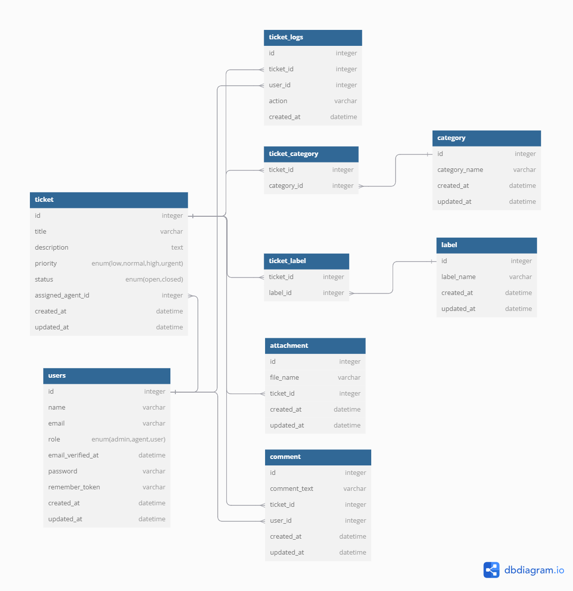

# Support Ticket System App

Assesment Project Fullstack Web Developer Intern INDI Technology

## Feature

Admin Side :

-   CRUD Users
-   Update & Delete Tickets (Include assign agent to tickets)
-   CRUD Label
-   CRUD Category
-   Create & Update Comment in <b>all</b> support ticket

Agent Side :

-   Update Ticket
-   Create & Update Comment in <b>assigned</b> support ticket

User Side :

-   Create Ticket
-   Create & Update Comment in <b>their own</b> support ticket

## Database Structure

     

